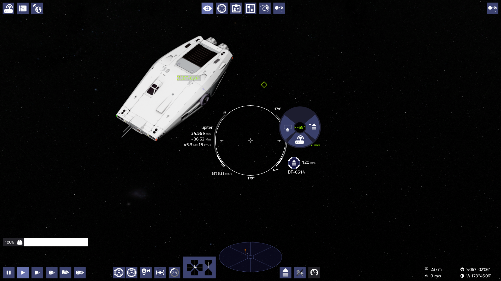
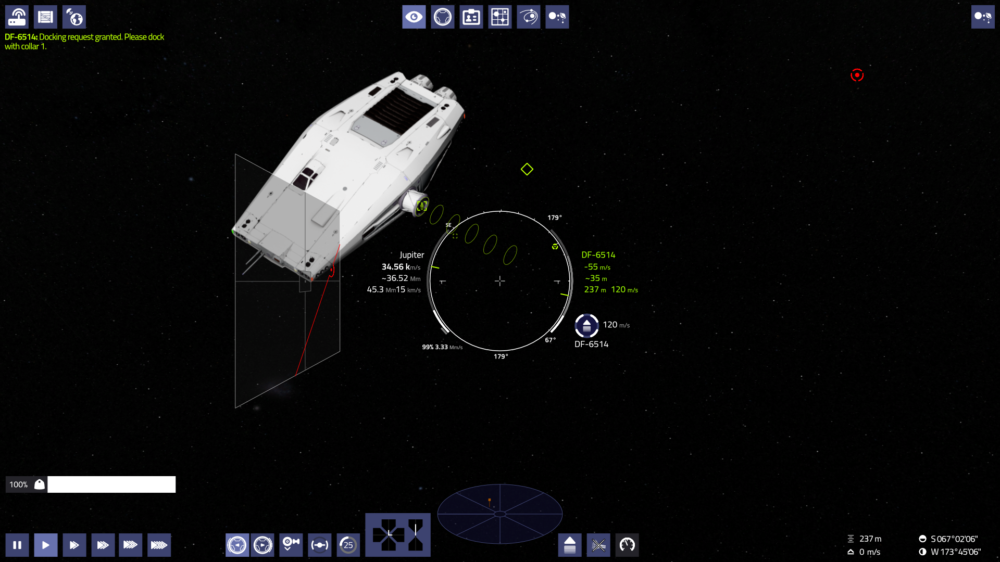
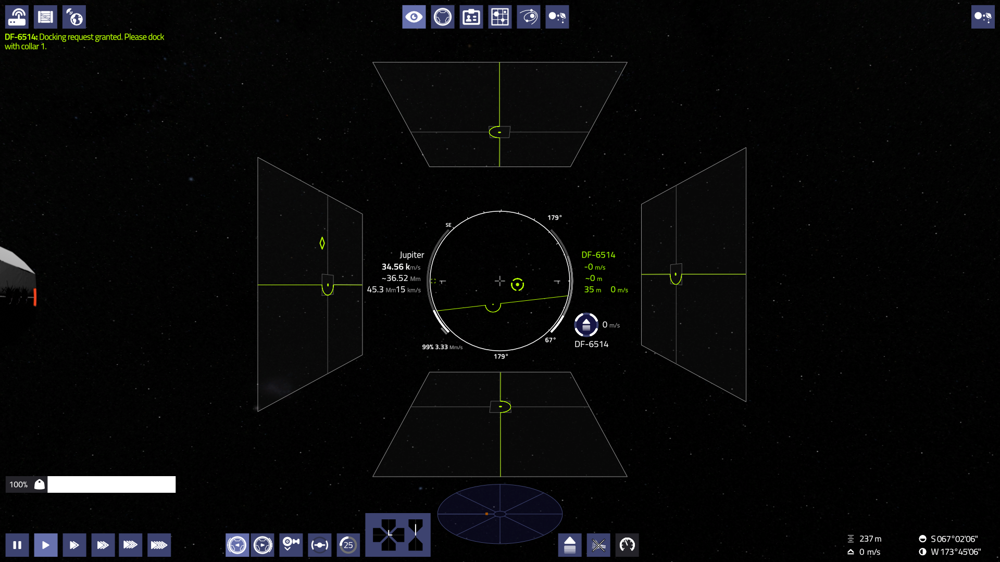
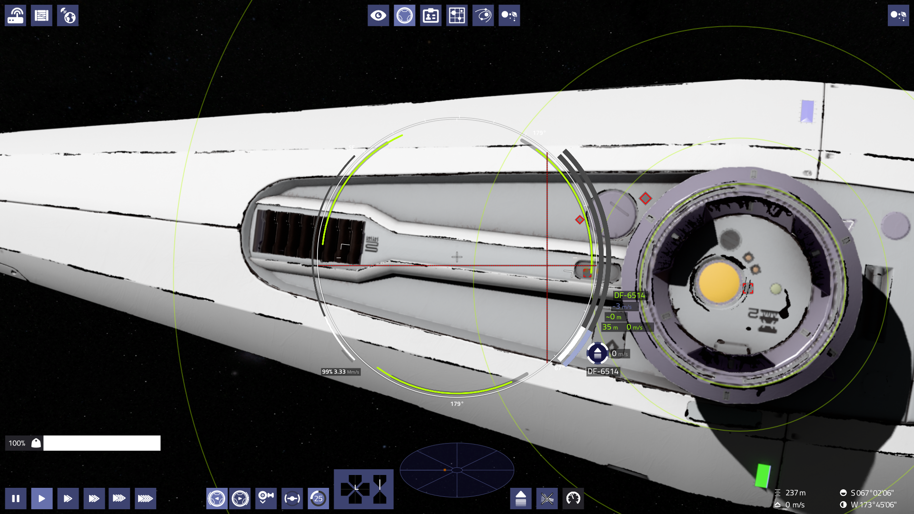
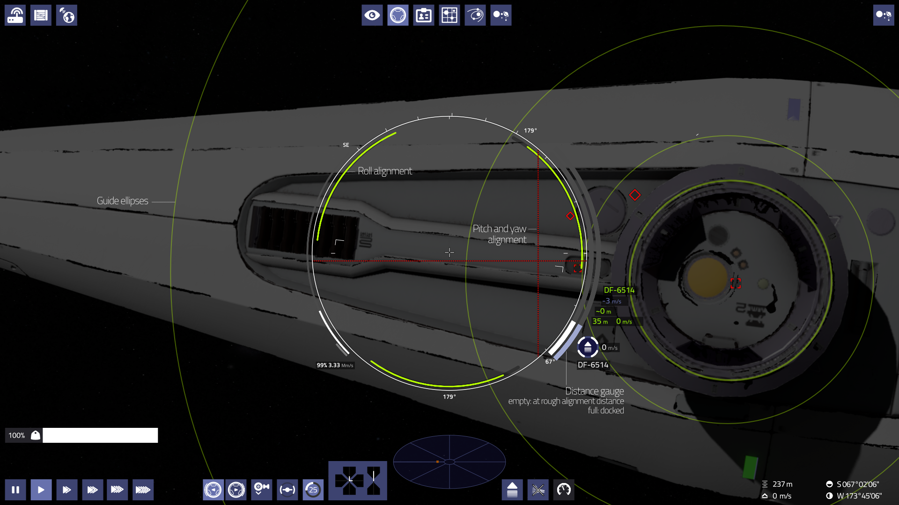
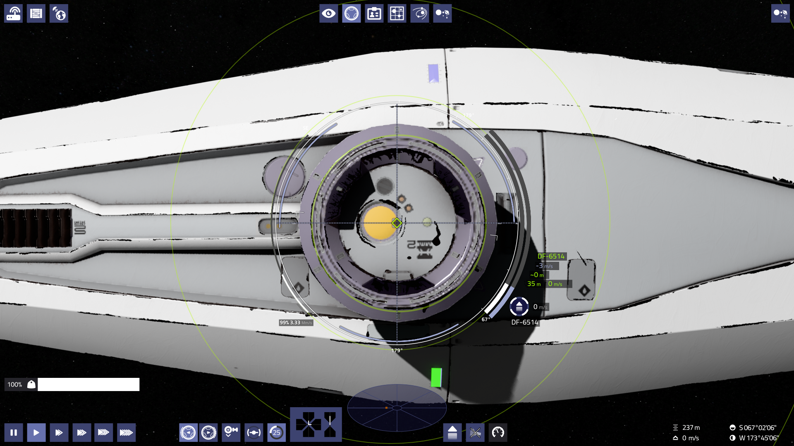

# External ship-to-ship docking

## Design overview

(draft)

Allowing ships to dock to each other could provide a bit of immersion, challenge and a lot of gameplay benefits by giving the player some more involved ways to work with their ships.  And it could also be implemented for orbital stations, giving variety for them too.

This page is a first stab at designing the feature, UI and my guess at what would need to be implemented for it to work.

## Gameplay flow

### Overview

- The player approached the target, engage position follow mode and reqests docking clearance
- Selects a docking collar (which also deploys it)
- Roughly aligns
- Switches over to docking camera for final alignment and approach
- Connects, then mission script does its thing.

### Approach

First the player approaches the target. Ideally they stop and engage position follow mode.

Then they request docking permission the same way as for a station:

The target ship grants permission and deploys a collar and instructs the player to dock with it. Generally the closest collar to the player will be deployed. The target indicator jumps to the collar, similarily to how it work with orbitals (jumping to pad).

The player then selects which docking collar they will use for docking at the bottom, next to the landing gear button. (suggested shortcust: Alt+numbers). Selecting a collar deploys it, and also brings up the rough alignment indicator. Selecting a collar limits all thrusters to the output of the weakest.

An additional indicator appears (dot with three arcs, top right) to indicate where the crosshair should point for alignment. An additional artificial horizon line indicates roll

Using those indicators, the player aligns themselves with the target ship. A prograde diamond also appears on this rough alignment plane. The plane uses half the field of view than the view's, so the edges represent about 45°):

These rough alignment indicators mirror the position of the docking collar on the ship. If the ship has a collar on the front or rear of the ship, then it is placed inside the reticule. (And a similar plane could be used as a landing aid.):

One could use these indicators for docking, albeit impreciesely. Or they can switch to the docking camera with the second button at the top row. This would switch to the camera of the selected docking port. (Suggested keyboard shortcut: alt+F1, fallback: collar1):

In this view, the controls and crusie control are aligned to the camera, and all accelerations are limited to the lowest value of the ship (typically side or down). 

Cruise control would use the orientation of the active docking collar when this view is active. (Similar to how it switches between vertical and horizontal based on landing gear status)

The player finishes alignment with the controls:

- The reticule is larger, and the stopping distance indicator is emphasized. 
- Everything yellow indicates data from target
- The guide ellipses seen above help with gauging movement, orientation and position
- The stop gauge works as usual
- Next to it is a distance gague (blue - color coded)
  - If empty, the ship is at the rough alignment distance (where the ellipses terminate)
  - When full, contact is made.
- Roll indicators at the edge of the reticule. 
  - The dark grays should be aligned with the yellow ones.
  - Aligmnents are valid at 120° increments
- Pitch and yaw cross for orientation alignment
  - 15° deviation at the edge of reticule 
  - Rotation aligned if cross is at the crosshair
  - Puts a cross at the reticule edge if deviation is bigger than 15°
- The target indicator can be used for position alignment
  - Puts a duplicate at the edge of the reticule, if it is outside do indicate direction
  - Prograde marker also puts a duplicate on it if outside

Typical workflow is to first align rotations, then position. Start a slow final approach when both ar aligned.

The indicators could change color to indicate safety:

The speed readout and the distance gauge shows speed safety:

- Blue: OK Ship would dock without issue (bellow 5m/s) 
- Yellow! : Hazardous. Ships might damaged, but still dock (between 5-10 m/s)
- Blinking red + ! : Dangerous. Ships would bounce off of each other, and get some damage. (above 10m/s)

Rotation also needs to be aligned for docking with a couple of degrees of tolerance:

- Blue: OK. Dock without issue (1-3°) 
- Yellow: Hazardous. Ships might damaged, but still snap into a docking orientation (3-6°)
- Red blinking: Dangerous. Ships would bounce off of each other, and get some damage. (above 6°)

Position tolerances are indicated by the color of the target indicator (horizontal and vertical axis):

- Blue: OK. Dock without issue (0-20 cm)
- Yellow: Hazardous. Ships might damaged, but still snap into a docking orientation (20-40cm)
- Red blinking: Dangerous. Ships would bounce off of each other, and get some damage. (above 40cm)

Position and rotation would automatically start to align when the collars are pretty close longitudinally (about 30cm for S1) to simulate the funelling nature of the petals and the shape of the collars. The above damages would be determined based on the values at the start of this auto-alignment.

(These values are subject to testing, might be too forgiving, might be too harsh. Possibly there could be a docking difficulity slider in the settings even.)

If everything is OK, then the ships dock to each other.

Cruise control button shows docking collar, and the flight mode display shows an undock button, similarily when the ship is docked to an orbital or ground station. Undocking would behave in a similar manner too: the flight computer would set a low cruise control speed, away from the target. Or better yet, gives a very gentle thrust away in manual mode, match position still active. Then the player would deselect the docking collar, which retracts it.

## Outline

- Interaction possibilities
  - SAR (I'd suggest this to be the first iteration
    - Sometimes SARees could have a bit of rotation, which the player would need to match.
  - Deliveries to ship destinations (might be a close second)
  - Trade dialog
  - Derelict salvaging
    - High likelihood of rotating target
  - Police searches (if scanning brings up suspicious stuff, player is ordered to submint to boarding and searching. Opportunities to flee while police prepares for docking)
    - Opportunities to text RPG talking out ourselves from the situation or bribe
    - Chance that they won't find anything if there are hidden compartments
    - Situations where they are dead set to find something irregular (Police harrasments if reputation / faction alignments is low or there's criminal record. There could be thresholds to this based on lawlessness)
  - Text RPG dialogs
  - Ship disabling and looting
  - Text RPG boarding action?
- Implementation
  - Formation flying / staying connected together
  - Collar extension/retraction (and selection)
    - Animations
      - Animated tags for derelicts/disabled ships later on
    - For player (when other ship wants to dock)
    - For NPC ships
  - Collar view
    - Controls and flight computer oriented to collar space
    - Limit all accelerations
    - Docking HUD
  - Connection detection
    - Same size
    - Different sizes
      - Petal retraction
      - Tag offset
    - Orientation thresholds
      - Within: connection
      - At threshold: connection + collision damage
      - Outside threshold: no connection + collision (might need very preciese collision detection on the petals/collars)
    - Speed thresholds 
      - Within threshold: connection without damage
      - At threshold: connection + collision damage
      - Too fast: no connection + collision damage
    - Position thresholds 
      - Within threshold: connection without damage
      - At threshold: connection + collision damage
      - Too misalligned: no connection + collision damage
  - Undocking
    - Release and gently pushing away with cruise control or **manual**
  - **Autopilot docking**
    - **Players might need and want it**
    - If other ships are to dock with each other or the player
  - Interactions
    - First iteration: in-orbit SAR needs docking. Nothing else changes
    - Second iteration: in-orbit SAR pops a dialog up, so the player can initiate transfer. With progress bar and such
    - Third iteration: same for courier and taxi missions
    - Fourth iteration: derelict looting
      - Randomly generated, player can stumble upon (later depending on sensors and line of sight)
      - Mission generated, player can buy coordinates
      - Docking request does not trigger coms response or collar deployment -> player needs to wiggle themselves in some situations
      - Player can opt to not dock, but looting then will net less and will take more time