# Model system overview

tl;dr: a simple scenegraph-based approach with some animation support.

Some of this information applies to every kind of mesh (ship, staction, etc), but some are more specific to ships or stations. You can omit those things from a building model for example.

## Model setup

For the game to detect the model, its files (meshes, textures, ship.model) need to be placed into specific directories in *Pioneer/data*. All assets have their subdirectory in one of these:

- data/models/ - model files all live here
  - buildings/ - planetside buildings
  - cockpits/ - cockpit models
  - misc/ - miscleanous things, like escape pods, cargo containers, etc
  - ships/ - spaceships
  - stations/ - orbital stations
  - weapons/ - missiles, guns and such

While the game doesn't really care which subdirectories of models/ these are, it is preferable to put them in their proper place for clarity.

Ships and stations, buildings and their properties then need to be set up with json files in their repsective directories inside *Pioneer/data*. Descriptions of these jsons are linked bellow:

- data/
   - ships/ - for [spaceships]()
   - stations/ - for [orbital and ground stations]()
   - configs/buildings/default.json - [defines buildings](), and how the city generation uses them.

## Importing models

We are using the Assimp importer, which theoretically supports [many different formats](http://assimp.sourceforge.net/main_features_formats.html) but you are expected to use only some:

- When node structure, node names and animations matter, use **Collada (.dae).***(subject to change in the near future to gltf)*

- Export settings (useful to save them as a preset:

  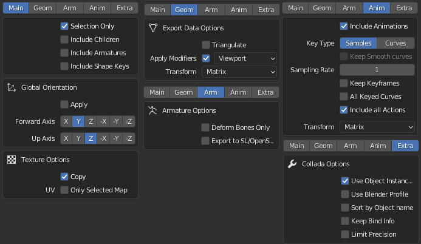

  - For models that does not have animation, the ```[ ] Include animations``` can be turned off.

- For static geometry, such as buildings, OBJ is recommended, this may allow for some optimizations

The only officially tested 3D modelling program at the moment is [Blender 3.4](http://www.blender.org/). For blender, a quick checklist is:

- Coordinates: X right, Y forward, Z up:

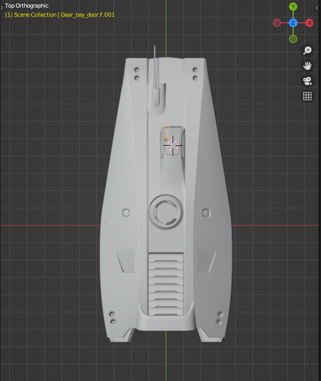

- Always generate UV coordinates for the model
- Versions downloaded from [blender.org](http://blender.org) support Collada out of the box, while the version distributed with some Linux distros doesn't.
- There is an alternative Collada exporter [made by the Godot team](https://github.com/godotengine/collada-exporter).

## Model definition file

Models must be placed under **data/models,** preferably in their respective categories (ships, cockpits, buildings, etc).

To define a model, create a ```name_here.model``` text file next to your exported mesh. You can use the example above as a template:

```sh
#Comments can be written like this
#Define all used materials first
Material some-material
diffuse 0.8 0.7 0.7
specular 0.3 0.3 0.3
shininess 40
tex_diff diffuse_texture.png
tex_spec specular_texture.png
tex_norm normal_map_texture.png
tex_glow glow_texture.png
use_patterns

#Meshes to be imported into this model, should be in the current folder
#Mixing different formats should be OK
#Level of Detail levels are set up like this:
lod 300
mesh fuselage_hi.dae
mesh engines_hi.dae

lod 150
mesh fuselage_mid.dae
mesh engines_mid.dae

lod 50
mesh fuselage_low.dae
mesh engines_low.dae

#Special meshes:
collision ship_collision.dae
mesh ship_shield.dae

#Animations are defined like this:
#anim name, first frame, last frame
anim gear_down 1 100
anim idle 101 201
```

## Materials

Only material names are imported from the 3D models, so you need to set up the material properties and used textures in the .model file like this:

```sh
material material_name
diffuse 0.8 0.7 0.7
specular 0.3 0.3 0.3
shininess 40
tex_diff diffuse_texture.png
tex_spec specular_texture.png
tex_norm normal_map_texture.png
tex_glow glow_texture.png
```

If the texture is in the same directory as the .model file, then only the filename is needed. You can also use textures from other directories via relative paths:

```sh
tex_diff diffuse_texture.png
tex_diff ../othership/other_texture.png
```

`../` means one level above in the directory structure, and you can string them together: `../../`

### Material properties

| Keyword      | Description                                                  |
| ------------ | ------------------------------------------------------------ |
| material     | Name. Mandatory! If exporting from Blender, you can use the name of  the Material as is. It's case-sensitive.(If in doubt, note that both .obj and .dae files are human readable, and you can find the assigned names in them with a text editor.) |
| diffuse      | Diffuse colour RGB. Default white.                           |
| specular     | Colour of specular highlights, RGB. Default white. Set to black to disable highlights. |
| emissive     | Self-illumination colour, RGB. Default black.                |
| shininess    | Sharpness/size of specular highlights, 0 - 128. Default 100. (Inverse of Roughness value of Blender) |
| opacity      | 0-100, controls transparency of the material. A node with a material opacity less than 100 is treated as transparent, otherwise opaque. |
| tex_diff     | Diffuse texture, file name If you don't specify this, a white dummy texture is generated. |
| tex_ambi     | Ambient occlusion texture, file name (in the same folder). Used for  faking ambient occlusion, by multiplying the diffuse with this. So the  darker the AO texture, the darker it will make the diffuse. |
| tex_glow     | Self-illumination texture, overrides emissive colour parameter. Default none. |
| tex_spec     | Specular highlight colour/intensity texture. Default none.  Multiplied by specular colour parameter, so set it to white to leave  control entirely to the texture. |
| tex_norm     | Normal map. Default none. You can create surface detail with it, which interacts with lighting. |
| use_patterns | This material will use the pattern/colour system. Read more below. |
| unlit        | No lighting, diffuse value can still be used to tint the result |
| alpha_test   | Pixels with alpha value < 0.5 are discarded, this is good for  fences and such. It produces sharp edges but the geometry does not need  to be sorted. |

### Textures

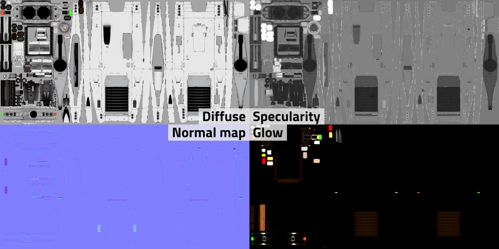

Textures preferably have power of two dimensions (256, 512, 1024, 2048 etc.), but they don't need to be square as long as the two dimensions are still power of two. 2048*1024 for dimensions are fine for example. The above example shows the diff, spec, norm and glow map of the Sinonatrix (which also has another set for its engines and some other details)

### Patterns

A system to mark customziable color areas on the model without splitting it to separate materials. The player can apply these patterns with custom colors to their ships in the Paint shop found in the Repair services tab on stations.

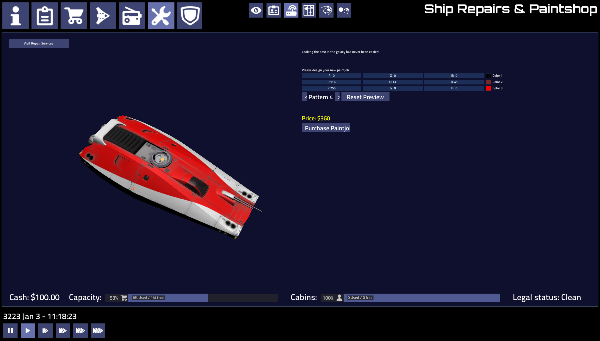

Patterns are small grayscale textures placed in the model folder,  named pattern*.png. Using gray or white colour you can mark the areas  tinted by one of the customizable colours (black marks unaffected  areas). The colours are set by the game (faction-specific ship colours,  shipyard UI for the player).

**The value ranges are:** 

- 0-63: not affecting (black)
- 64-127: first color (dark gray)
- 128-191: second color (mid gray)
- 192-255: third color (light gray/white)

You can set all three channels to these in RGB, or only the L channel in HSL (Hue, Saturation, Level) to get the needed gray.

The **alpha channel** of the pattern defines it's transparency. It  can be used for gradual changes from colored to blank, but not for  gradients between different gray ranges. Useful for showing wear on the  pattern, or coloring some parts more lightly. Alpha channel can be  created by using a layer mask.

Antialiasing (which generates small gradients) can cause  artifacts, especially at black-white boundaries. To avoid it, try  lowering the contrast on problematic places. Even different grays can be used from the same range, they will indicate the same color.

The system has several limitations: it is not meant to do fine details,  transitioning from one color to another is sharp and it works best with white/light textures. You'll have to experiment.

## Detail levels (LoD)

Meshes can be grouped into detail levels using the `lod pixelsize` directive:

```sh
lod 100
mesh hull_low.dae

lod 200
mesh hull_med.dae

lod 1000
mesh hull_hi.dae
mesh landing_gear.dae
```

A detail level will be picked if the approximate radius of the model on screen is less than `pixelsize` (for the highest level it does not matter as long as it's larger than the others). Use the modelviewer to find optimal sizes.

You may specify any number of detail levels in any order, they will be sorted according to size.

## Shield and collision meshes

These are special meshes defining collision, and how the shield is shown (and hit). These can be in their separate mesh files, or included in the high LoD.

#### Shield

If you name an object `shipname\*_shield`, it will be used as  the shield mesh for the ship. It can be in the top LoD .dae (.obj, etc), or in a separate file, but then you have to define that .dae for the  top LoD too in the .model file. If not present, then the game will generate a spherical shield around  the ship.

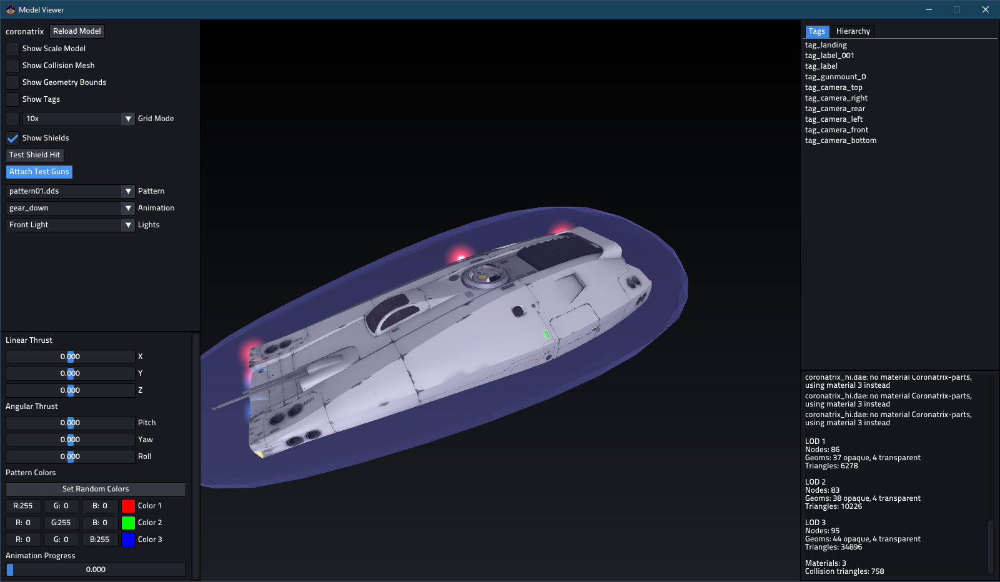

#### Collision

By default, the **collision mesh** of a model is the bounding box of all the meshes.

For more control, name objects with the prefix `collision_` and  they will be added to form a collision mesh (these objects will not be  visible geometry, and the bounding box will not be generated).

Note, these names are reserved for station collision trigger surfaces:

- collision_pad1
- collision_pad2
- collision_pad3
- collision_pad4
- etc

You can also import a separate mesh using the `collision` directive in the model definition:

```sh
collision collision.obj
```

The collision mesh is separate from all detail levels, so it should be only defined once.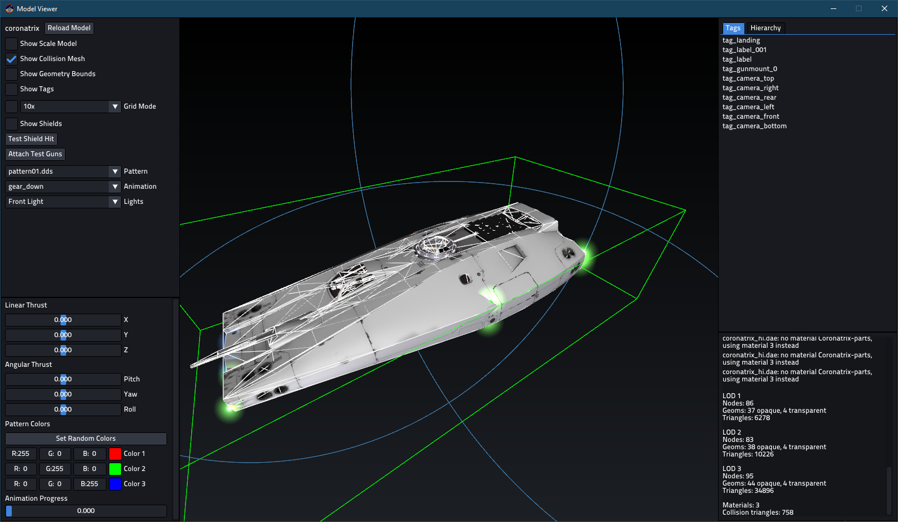

Collision meshes are also used to detect if the ship has landed. You need to extend a little bit of the mesh to the level of the gears for proper detection:

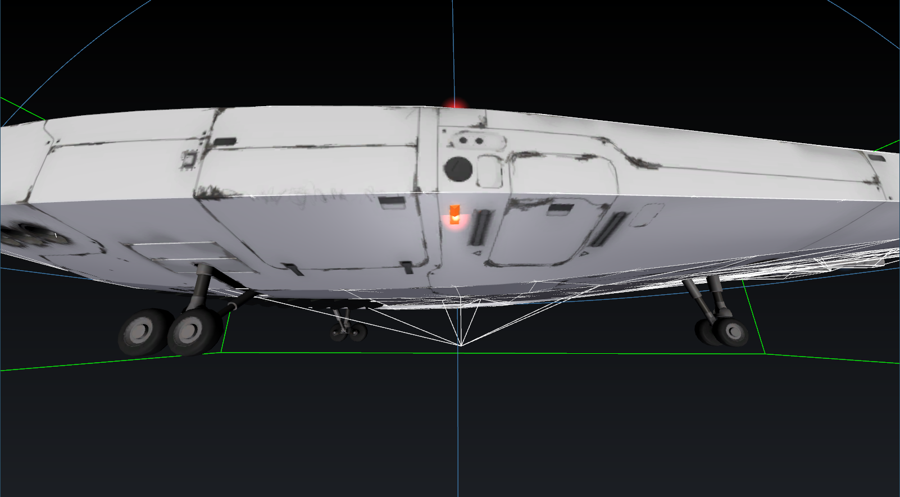

## Decals

Decals are meant for customizable insignia on spaceships and changing  advertisements on space stations. Up to four unique decals are available for a model (multiple identical decals are allowed). Place a piece of  geometry, usually a flat quad, with proper UV coordinates and name it  decal_01, 02, 03 or 04. The game will then use a special material on the geometry, or make it invisible if no decal is to be used.


## Tags 

Models have special "tag points" marked with specifically named **empty objects** in Blender. They define thruster, lights and camera placement, weapon fire location and so on. 

These special nodes are **only imported from the most detailed LOD**, there is no need to duplicate them. They are rendered outside the detail level system.

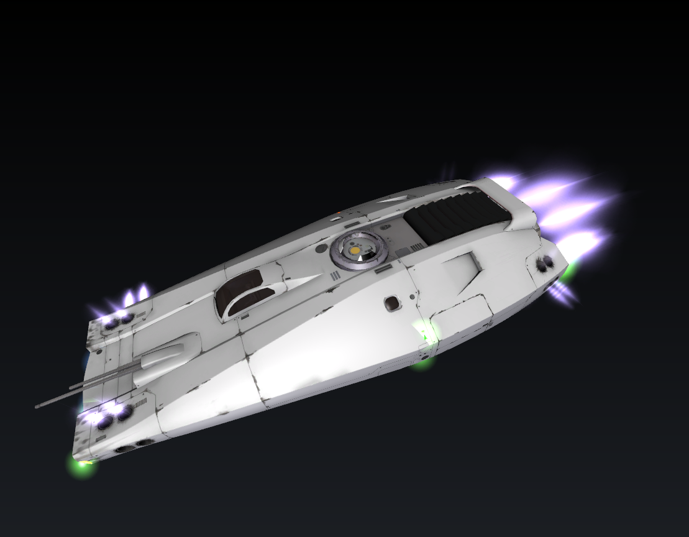

### Cameras

These define the position and orientation of the six internal view cameras. If one is missing, tag_camera will be used with its orientation adjusted for the appropriate view direction. If there's none, ship center is used. 

**Camera tag scale shouls be 1 on all three axes to avoid glitches!**

Their orientation is: Z - out, X - left, Y - up:

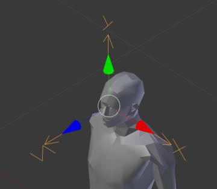

Their names are self-explanatory, and they are preferably placed in the cockpit, or onto sensors visible on the model:

- `tag_camera` - fallback for missing camera tags
- `tag_camera_front` 
- `tag_camera_rear` 
- `tag_camera_left`
- `tag_camera_right`
- `tag_camera_top`
- `tag_camera_bottom`


### Thrusters

Preferred display mode for these empties is **Single Arrow**, which shows only the Z axis:


Thruster size is taken from the object scale. Begin the object name with either:

- `thruster_` - lights up both for turning and translation
-  `thruster_linear` - only lights up for translation

The game determines which thrusters should fire automatically based on their location and orientation.

Thruster colour can be modified, see: https://github.com/pioneerspacesim/pioneer/pull/3948 (not working currently)

### Billboard lights

Simple light sprites placed using empty nodes with special naming  `navlight_*`. Their scale defines the size of the light. Orientation does not matter. 

This feature will be more customizable someday, but for  now the following name prefixes are recognized:

- `navlight_red`: blinking red light, with ships when landing gear is down. On stations it is on constantly
- `navlight_green`: blinking green light when landing gear is down

- `navlight_` is blue, on when landing gear is down.

- space stations, `navlight_pad<number>` lights change according to landing pad reservation status

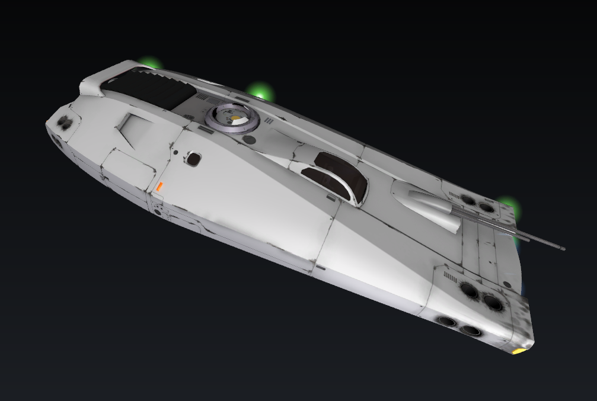

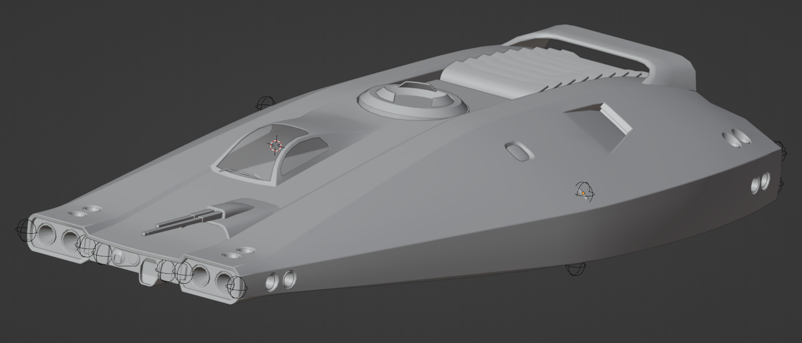

### Labels

Dynamic 3D labels are meant for naming ships and space stations. Put an **empty** object in the model and give it a name beginning with `label.`  The text is set by the game at runtime if supported. Important: not "tag_label" but **"label."**!

Node scale can be used as usual but the text is not constrained to the node bounds or anything like that, so some trial will be  required. 

You can use multiple label nodes but they will all show the same text.

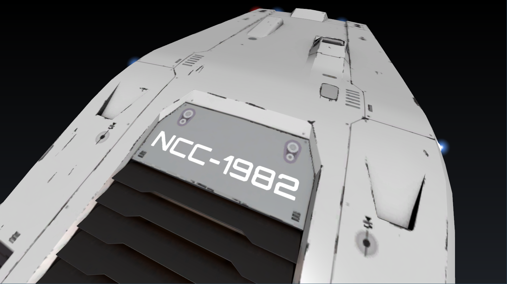

The tags orientation defines the direction of the text: Z out, X right, Y up:

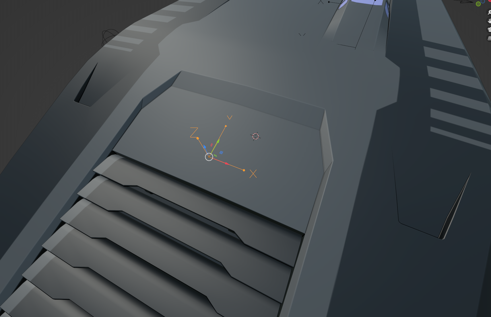

### Landing tag

Named `tag_landing`, it defines the placement of the ship while landed. Basically shows ground level:

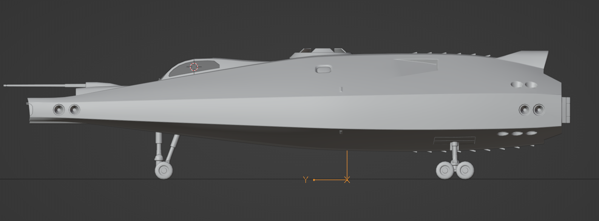

**Important note:** this tag is not used for landing detection. You need to add a bit of collision mesh extending to this hight to allow the ship to land.

### Guns

These can define the point where the weapon projectiles are shot from.

- `tag_gunmount_0` front gun
- `tag_gunmount_1` rear gun


## Animations

Set up in the model file with their starting and end frames:

```
anim gear_down 1 100
```

An animation consists of Channels. Each channel controls one node  (always a MatrixTransform) and has a list of position and rotation Keys. Each key has a time and value. Keys are always linearly interpolated.

Because of the linear interpolation, it is advised to bake animations *(TODO: baking guide)*, so easings are preserved. This is especially important for more complex animations:

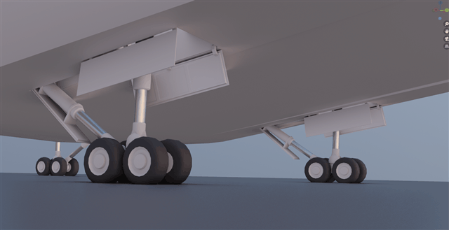

There are two animations supported currently:

- `idle` - a looping animation. Good for rotating sections, radar dishes, windmills for example
- `gear_down` - lowering of the langing gear. Frame 0 is fully raised, the endframe is when it is fully lowered. Played backwards for raising the gear.

At first the animations had proper play/pause/loop functionality  but right now it is not so. Animation progress (and fun things like serialization) needs to be controlled directly by whatever feature uses  the animation (see: landing gear).

## Debuging models

You can access some in-game model debug functionality via the debug menu accessed via `ctrl+i`:


### Modelviewer

Additionally Pioneer provides a model viewer with even more functionality like shield display, and an error log. This can be accessed by launching `editor.exe` from where Pioneer is installed.

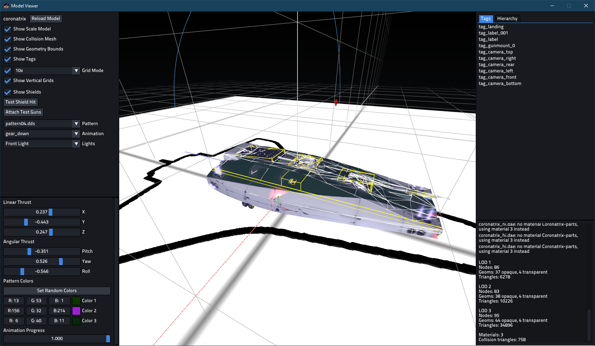


It can be helpful to place a shortcut to the model directory while working on it, so one can quickly check it out.

## Internal workings

You can find some testcase models at [https://github.com/Luomu/newmodels](https://github.com/Luomu/newmodels).

The internal scene graph consists of several of these nodes:

| Node            | Base class. A node can have a name and one or more parents.  |
| --------------- | ------------------------------------------------------------ |
| Group           | A group is a Node that can have several children.            |
| MatrixTransform | A Group that applies a transformation to its child nodes when rendering. |
| StaticGeometry  | Contains one or more StaticMeshes.                           |
| LOD             | Detail level control node, picks one of the child nodes based on the approximate size of the model on screen. |
| ModelNode       | Can be used to attach another Model as a submodel. Use case: dynamic equipment on ships. |
| More!           | Some marginal nodes that exist at the moment are: Thruster: spaceship thruster Billboard: can be used for light sprites (navlights on ships) Label3D: dynamic 2d text, meant for labeling ships |

MatrixTransform nodes are the most commonly used, if a geometry is  rotated or scaled it will be parented to a MatrixTransform. A simple  form of instancing can be achieved by adding a geometry as the child of  several separate MatrixTransforms.

During rendering, the graph is traversed twice. Once for opaque  objects, and once for transparent objects (which includes decals,  thrusters). The model system does not perform any depth sorting, this  improvement job needs to be done elsewhere.
